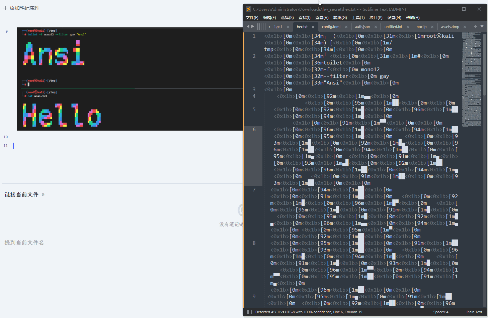

# Ansi Highlight

An Obsidian plugin for displaying ANSI-highlighted text, ideal for recording terminal output with colors and styles. Recommended to use with [ansi_copy](https://github.com/Ryanu9/ansi_copy).

## Installation

- Copy `main.js`, `styles.css`, and `manifest.json` into your Obsidian `plugins/` directory.

## Usage

- Create an `ansi` code block and paste ANSI source code into it.
- Ctrl + Left-click on the code block area to enter edit mode.
- Use the toggle in the top-right corner of the code block to switch between raw ANSI source mode and rendered preview mode.
